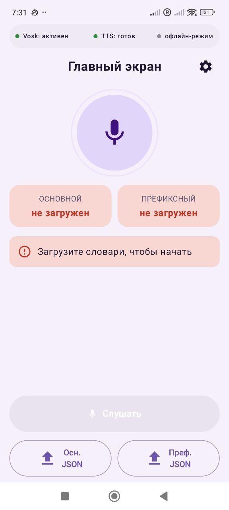
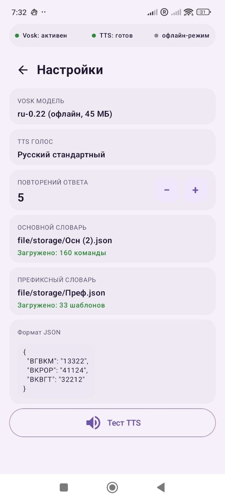
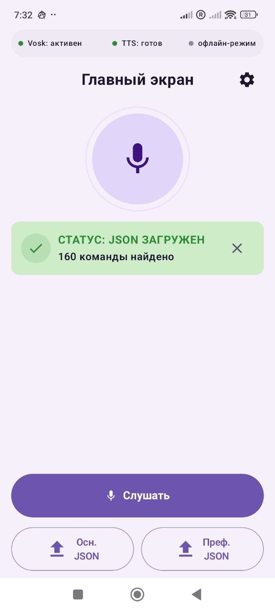
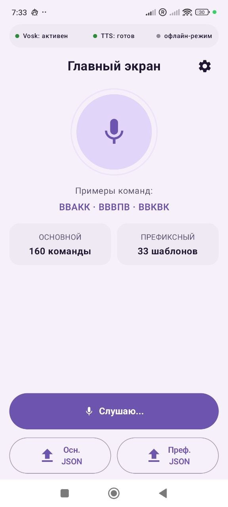
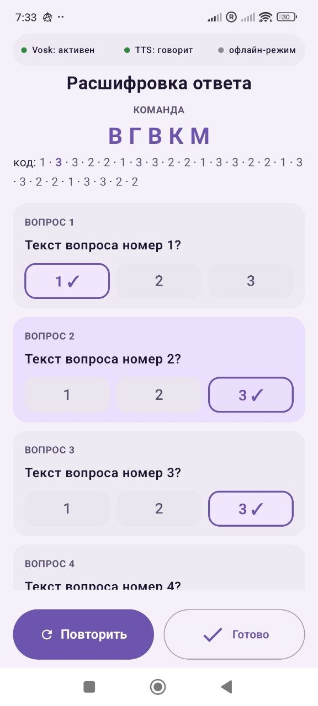
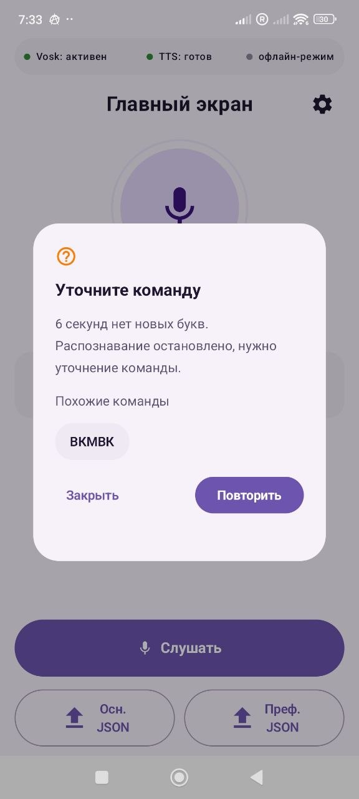

```markdown
# 🎙️ Voice Commander

**Offline voice assistant for abbreviation commands**  
**Офлайн голосовой ассистент для команд-аббревиатур**  
**Офлайн голосовий асистент для команд-абревіатур**


[](https://github.com/550953/kotlin-voice-commander/blob/main/LICENSE)
[](https://github.com/550953/kotlin-voice-commander/releases/latest)

---

[](#en)
[](#ru)
[](#ua)

---

<a name="en"></a>
## 🇬🇧 English

**[Download APK](https://github.com/550953/kotlin-voice-commander/releases/latest)** · **[Quick Start](#quick-start-en)** · **[Watch Demo](https://x.com/550953/status/2051284395743441243)**

### What is this?

Voice Commander is a fully offline Android app that recognizes short abbreviation commands (e.g. `ВГВКМ`, `ВКРОР`) and converts them into coded responses via TTS (text-to-speech).

No internet. No cloud. Works in noisy environments — military comms, industrial control, accessibility devices.

> Swap Vosk model and `dictionary.json` to use any language.

### Demo

<div align="center">

<a href="https://x.com/550953/status/2051284395743441243">
  
</a>

*Tap the image to watch the demo — live recognition in action*

</div>

### Screenshots

<div align="center">

| | | |
|:-:|:-:|:-:|
| <br>*Initial State* | <br>*Permissions* | <br>*JSON Setup* |
| <br>*Ready Config* | <br>*Voice Execution* | <br>*Recognition Feedback* |

</div>

### How it works

```
Speak abbreviation → Vosk recognizes → Two-pass search → TTS speaks the result
```

**Pass 1** — prefix lookup (first 3 characters)  
**Pass 2** — exact match in main dictionary  
**Result** — code spoken digit by digit: `13322` → *"one · three · three · two · two"*

<a name="quick-start-en"></a>
### Quick Start

1. Download APK from [Releases](https://github.com/550953/kotlin-voice-commander/releases/latest) or clone and build
2. Place Vosk model into `app/src/main/assets/model/`  
   → Download: [alphacephei.com/vosk/models](https://alphacephei.com/vosk/models) (vosk-model-small-ru)
3. Add `dictionary.json` and `prefix.json` to `app/src/main/assets/`
4. Launch — grant microphone permission — tap **Listen**

### Dictionary format

`dictionary.json`:
```json
{
  "ВГВКМ": "13322",
  "ВКРОР": "41124"
}
```

`prefix.json`:
```json
{
  "ВГВ": ["ВГВКМ"],
  "ВКР": ["ВКРОР", "ВКРВК"]
}
```

### Tech Stack

| Component | Technology |
|---|---|
| Language | Kotlin |
| UI | Jetpack Compose + Material 3 |
| Speech Recognition | Vosk (offline, ru-0.22) |
| Text-to-Speech | Android TTS |
| JSON parsing | Gson |
| Min SDK | Android 8.0 (API 26) |
| Internet | ❌ Not required |

### Required Permissions

| Permission | Purpose |
|---|---|
| `RECORD_AUDIO` | Speech recognition |
| `READ_EXTERNAL_STORAGE` | Load dictionary JSON files |

### Where it's useful

- 🏭 **Industrial / SCADA** — voice control without internet
- 🎖️ **Military / special comms** — short coded commands
- ♿ **Accessibility (AAC)** — voice shortcuts for limited mobility
- 🏥 **Medical / emergency** — fast triage codes
- 📦 **Warehouse / logistics** — pick-by-voice operations
- 🎓 **Training / QA** — voice-driven test scripts
- 🔒 **Air-gapped systems** — zero network dependency

---

<a name="ru"></a>
## 🇷🇺 Русский

**[Скачать APK](https://github.com/550953/kotlin-voice-commander/releases/latest)** · **[Быстрый старт](#quick-start-ru)** · **[Смотреть демо](https://x.com/550953/status/2051284395743441243)**

### Что это?

Voice Commander — полностью офлайн Android-приложение, которое распознаёт короткие команды-аббревиатуры (например `ВГВКМ`, `ВКРОР`) и преобразует их в кодовые ответы через TTS.

Без интернета. Без облака. Работает в шумных условиях — производство, военная связь, системы управления, средства реабилитации.

> Замените модель Vosk и `dictionary.json` для работы с любым языком.

### Демо

<div align="center">

<a href="https://x.com/550953/status/2051284395743441243">
  
</a>

*Нажмите на изображение — живое распознавание в действии*

</div>

### Как работает

```
Произнести аббревиатуру → Vosk распознаёт → Двухпроходный поиск → TTS озвучивает результат
```

**Проход 1** — поиск по префиксу (первые 3 символа)  
**Проход 2** — точное совпадение в основном словаре  
**Результат** — код по цифрам: `13322` → *«один · три · три · два · два»*

<a name="quick-start-ru"></a>
### Быстрый старт

1. Скачать APK из [Releases](https://github.com/550953/kotlin-voice-commander/releases/latest) или клонировать и собрать
2. Положить модель Vosk в `app/src/main/assets/model/`  
   → Скачать: [alphacephei.com/vosk/models](https://alphacephei.com/vosk/models) (vosk-model-small-ru)
3. Добавить `dictionary.json` и `prefix.json` в `app/src/main/assets/`
4. Запустить — выдать разрешение на микрофон — нажать **Слушать**

### Формат словарей

`dictionary.json`:
```json
{
  "ВГВКМ": "13322",
  "ВКРОР": "41124"
}
```

`prefix.json`:
```json
{
  "ВГВ": ["ВГВКМ"],
  "ВКР": ["ВКРОР", "ВКРВК"]
}
```

### Стек

| Компонент | Технология |
|---|---|
| Язык | Kotlin |
| UI | Jetpack Compose + Material 3 |
| Распознавание речи | Vosk (офлайн, ru-0.22) |
| Озвучивание | Android TTS |
| JSON | Gson |
| Мин. SDK | Android 8.0 (API 26) |
| Интернет | ❌ Не нужен |

### Применение

- 🏭 **Промышленность / SCADA** — голосовое управление без интернета
- 🎖️ **Военная / спецсвязь** — короткие кодовые команды
- ♿ **Доступная среда (AAC)** — голосовые команды для людей с ограниченной подвижностью
- 🏥 **Медицина / экстренные службы** — быстрые коды триажа
- 📦 **Склад / логистика** — голосовое управление операциями
- 🎓 **Обучение / QA** — голосовые тестовые сценарии
- 🔒 **Изолированные системы** — без зависимости от сети

---

<a name="ua"></a>
## 🇺🇦 Українська

**[Завантажити APK](https://github.com/550953/kotlin-voice-commander/releases/latest)** · **[Швидкий старт](#quick-start-ua)** · **[Дивитись демо](https://x.com/550953/status/2051284395743441243)**

### Що це?

Voice Commander — повністю офлайн Android-застосунок, який розпізнає короткі команди-абревіатури (наприклад `ВГВКМ`, `ВКРОР`) і перетворює їх на кодові відповіді через TTS.

Без інтернету. Без хмари. Працює в галасливих умовах — виробництво, військовий зв'язок, системи управління, засоби реабілітації.

> Замініть модель Vosk і `dictionary.json` для роботи з будь-якою мовою.

### Демо

<div align="center">

<a href="https://x.com/550953/status/2051284395743441243">
  
</a>

*Натисніть на зображення — живе розпізнавання в дії*

</div>

### Як працює

```
Вимовити абревіатуру → Vosk розпізнає → Двопрохідний пошук → TTS озвучує результат
```

**Прохід 1** — пошук за префіксом (перші 3 символи)  
**Прохід 2** — точний збіг в основному словнику  
**Результат** — код по цифрах: `13322` → *«один · три · три · два · два»*

<a name="quick-start-ua"></a>
### Швидкий старт

1. Завантажити APK з [Releases](https://github.com/550953/kotlin-voice-commander/releases/latest) або клонувати та зібрати
2. Покласти модель Vosk у `app/src/main/assets/model/`  
   → Завантажити: [alphacephei.com/vosk/models](https://alphacephei.com/vosk/models) (vosk-model-small-ru)
3. Додати `dictionary.json` і `prefix.json` у `app/src/main/assets/`
4. Запустити — надати дозвіл на мікрофон — натиснути **Слухати**

### Формат словників

`dictionary.json`:
```json
{
  "ВГВКМ": "13322",
  "ВКРОР": "41124"
}
```

`prefix.json`:
```json
{
  "ВГВ": ["ВГВКМ"],
  "ВКР": ["ВКРОР", "ВКРВК"]
}
```

### Стек

| Компонент | Технологія |
|---|---|
| Мова | Kotlin |
| UI | Jetpack Compose + Material 3 |
| Розпізнавання мовлення | Vosk (офлайн, ru-0.22) |
| Озвучування | Android TTS |
| JSON | Gson |
| Мін. SDK | Android 8.0 (API 26) |
| Інтернет | ❌ Не потрібен |

### Застосування

- 🏭 **Промисловість / SCADA** — голосове керування без інтернету
- 🎖️ **Військовий / спецзв'язок** — короткі кодові команди
- ♿ **Доступне середовище (AAC)** — голосові команди для людей з обмеженою рухливістю
- 🏥 **Медицина / екстрені служби** — швидкі коди тріажу
- 📦 **Склад / логістика** — голосове керування операціями
- 🎓 **Навчання / QA** — голосові тестові сценарії
- 🔒 **Ізольовані системи** — без залежності від мережі

---

## Author

**Nikolay Shikin** — freelance developer & designer  
🌐 [shikinn.com](https://shikinn.com)  
💼 [freelance.ru/guru_sun](https://freelance.ru/guru_sun)  
🐙 [github.com/550953](https://github.com/550953)

---

*MIT License · Made in Ukraine 🇺🇦*
```
